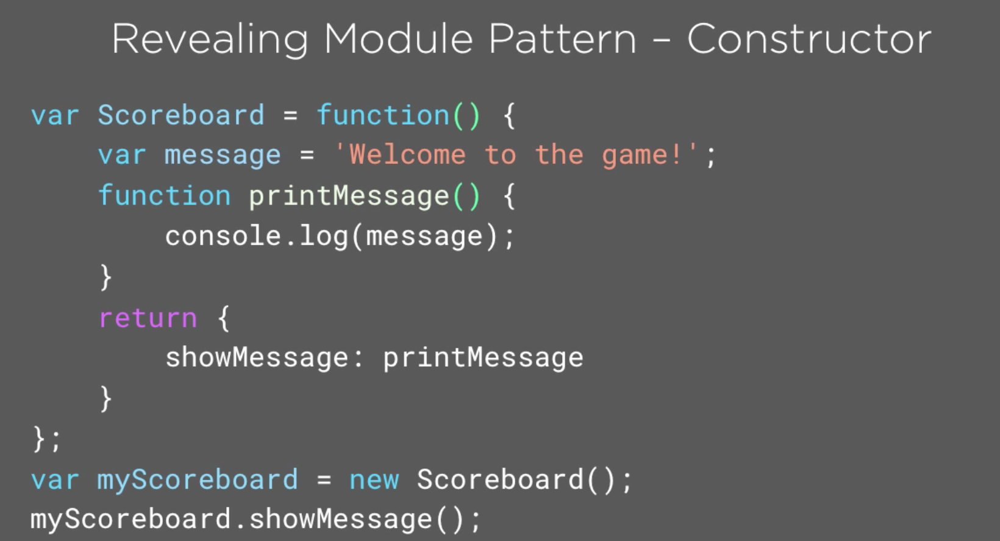
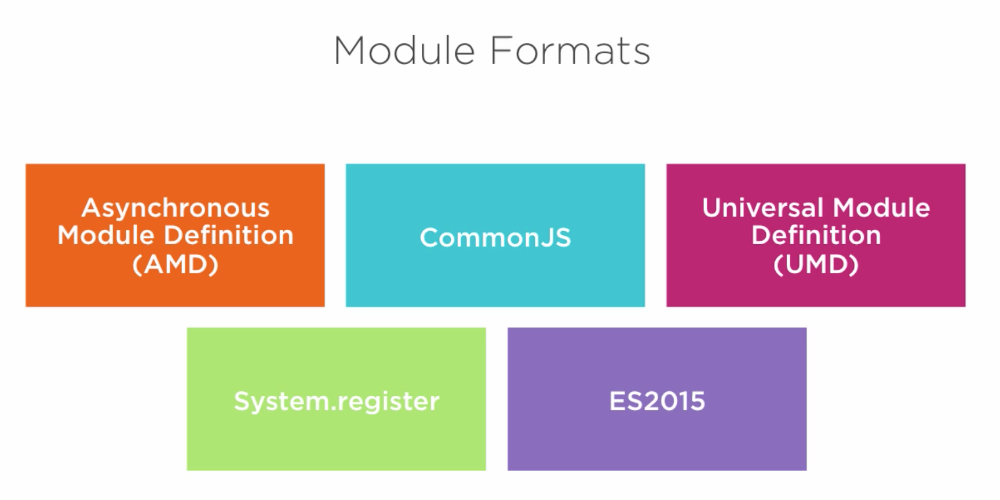
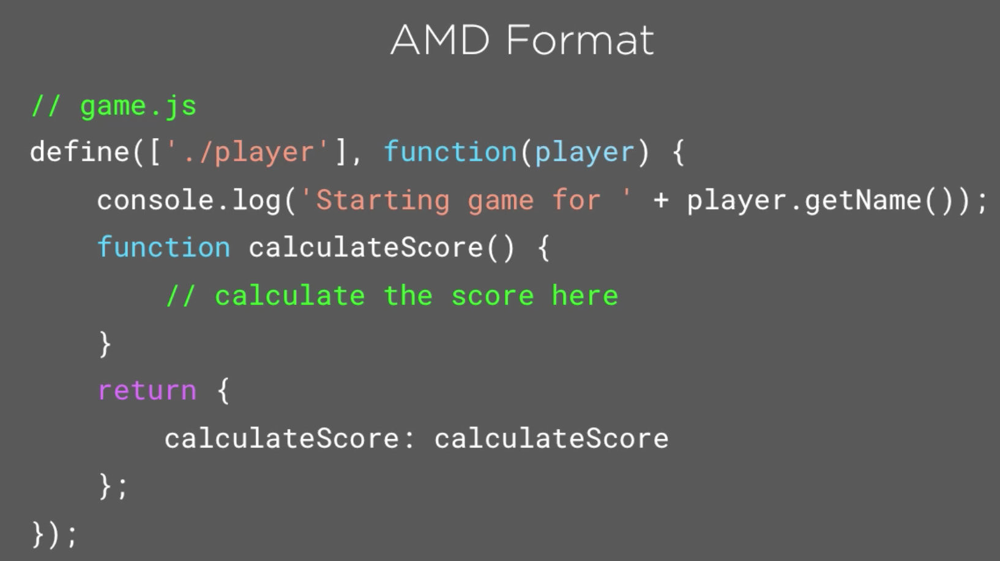
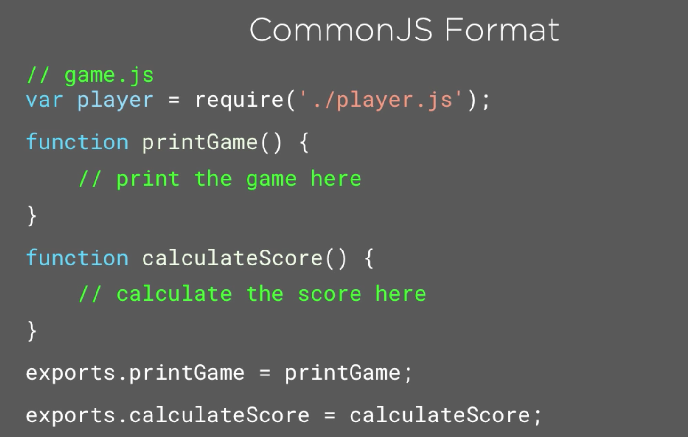

# js
js modules
JavaScript is a loosely typed language and so a variable can have different types assigned.  

**JavaScript Module Fundamentals**
*by Brice Wilson*

JavaScript applications have grown increasingly complex. This course will teach you the basics of writing modular, maintainable JavaScript using popular formats, loaders, and bundlers.

